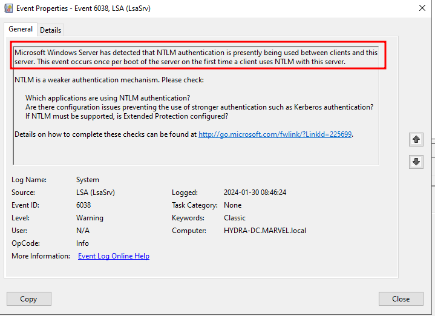
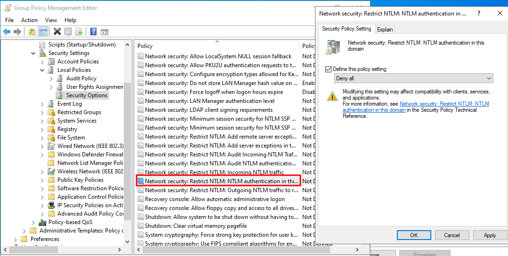
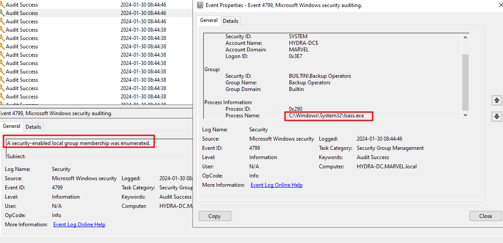
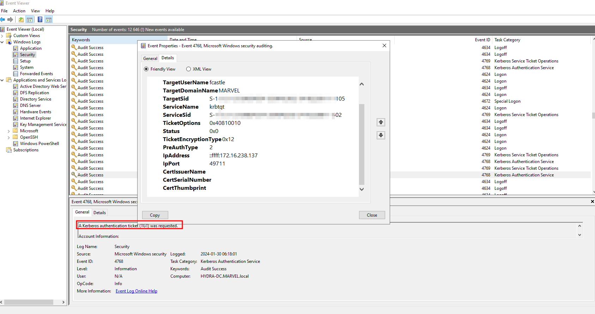

# Post Compromise - Defence Overview
Looking back at the Event Viewer on the domain controller, we can find the following events being logged in the domain controller during the different attacking stages of the pentest.

### NTLM Authentication
While conducting Pass-The-Hash attacks on the clients we could see the following event being logged in the system:

Mitigation techniques to remove this vulnerability is to disable/restrict NTLM authentication within the domain.
This can be both good and bad depending on the company environment.
Effects that may hurt the domain is legacy systems that may only rely on NTLM authentication, in that case it would be smartest to restrict the NTLM traffic and control it.
Disabling the NTLM authentication in the domain can be done through the GPME on the domain controller (Windows Server):

### Mimikatz LSASS Dump
The following event was identified in the Event Manager in the DC when users where enumerated using Mimikatz LSASS.

### Kerberos Ticket Request
As we compromised the DC and got admin privilages, we were able to request a golden ticket from the TGS.
The event was recorded in the Event Manager as the following:

### Steps of remediation:::
